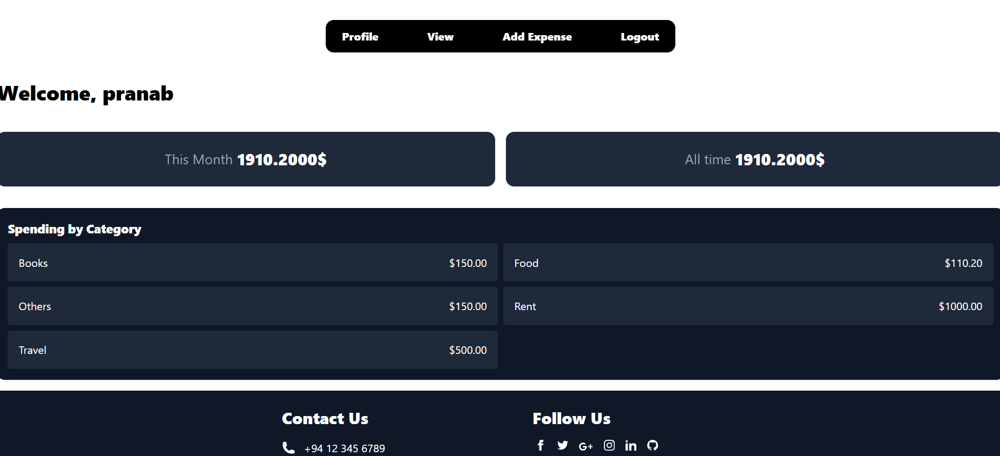
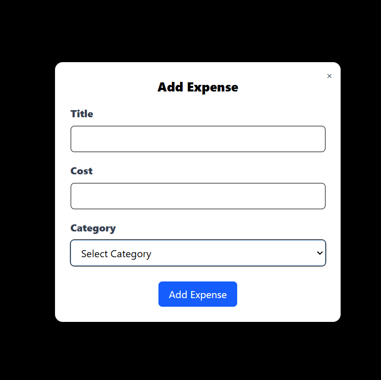

# 💰 Expense Tracker

A simple web-based expense tracker built with Django. Users can register, log in, add/view their expenses, and track monthly and all-time spending.

⚠️This project does not include a database export or setup instructions, and cannot be run outside the original development environment. 
The code is uploaded for academic or reference purposes only.

##  Features

- User registration & login/logout
- Add new expense entries with category, cost, and timestamp
- Dashboard with:
  - Total spending this month
  - All-time total spending
  - Expenses By categories
- Email verification via Gmail's SMTP server
- Built-in session-based authentication

## File Structure
project/  
│  
├── homepage/               # Handles user login/registration  
├── dashboard/              # Dashboard and expense logic  
├── project/                # Django settings module  
├── db.sqlite3              # SQLite database  
├── manage.py  
├── README.md  
└── .gitignore  

## 🛠️ Technologies Used

- Python 3.x
- Django 5.2.4
- SQLite (default database)
- TailwindCSS 

## Screenshots

###  Home Page

### Dashboard

### Expenses

###  Adding Expenses

---

## Author

**Pranab Roy**  
GitHub: [@PranabR0Y](https://github.com/PranabR0Y)

